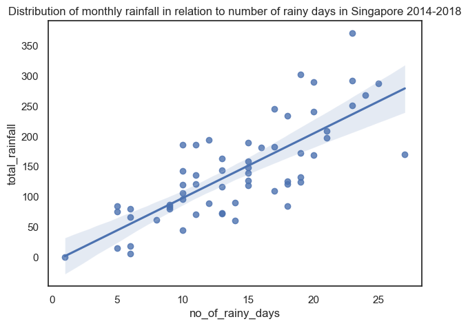

#  

Project: Analysis of Singapore Dengue Cases using Historical Weather Data 

## Background

According to the Meteorological Services Singapore, Singapore has typical tropical climate with adundant rainfall, high and uniform temperatures and high humidity all year round, since its situated near the equator. There are other metrics of climate such as sun shine duration, wind speed, cloud cover etc. In this project, we will look into the data sets based on the three core metrics - rainfall, temperature and humidity which are believed to responsible in relation to the increase of dengue cases in the country.

([Picture Source](https://bewareofthebugs.com/diseases/dengue-fever/))

----

## Problem Statement

*To provide insights and recommendations for National Environment Agency's dengue awareness campaigns using weather and dengue case data.* 

----

## Datasets

All the datasets used in the project come from [data.gov.sg](data.gov.sg).

Here's a data dictionary of cleaned up dataframe for a quick overview of features/variables/columns, alongside data types and descriptions. 

|Feature|Type|Dataset|Description|
|---|---|---|---|
|yr (2014-2018)|int|final|Year column indicating the timeframe| 
|mth (1-12)|int|final|Month column indicating the timeframe| 
|total_rainfall|float|final|Total rainfall in mm in a month| 
|no_of_rainy_days|float|final|The number of rain days (day with rainfall amount of 0.2mm or more) in a month recorded|
|mean_rh|float|final|Monthly mean of relative humidity, percentages are expressed as a value over 100.|
|temp_mean_daily_min|float|final|Monthly mean daily minimum temperature|
|number|float|final|Number of reported dengue cases over a month|

----

## Project Summary

Weather data explorations show that Singapore has an abundant rainfall across the years of study. In general, we observe a repeated pattern of distribution in total rainfall over the year for the period of 2014-2018. The lowest total rainfall usually happens in Q1 and the opposite usually happens in Q4. There are however exceptions. For instance, the lowest rainfall month in 2017 is in July. It is likely the total rainfall is related to the number of rainy days. If a month has the highest total number rainy days in that year, it is very possible the same month also has the highest total rainfall. The opposite is seems true as well. But there are outliners. In 2018, November has the highest total number of rainy days of 27, yet January outperforms November in terms of total rainfall.

---

It is oberved the distribution of monthly rainfall in Singapore is skewed right, indicating the mode value (the value with the highest number of occurances) lower than the mean. It means that Singapore has more months with lower than 142mm rainfall.

---

The scatterplot of total rainfall against the number of rainy days shows a significant positive correlation. It makes sense to observe a higher rainfall amount during a month with more rainy days.

---

The visualisations of weather data as the above also show a relatively constant high temperature and high humidity in Singapore throughout the years.

For the period of analysis, the average daily minimum temperature Singapore falls within the range of 24-26.5°C and the relative humidity is in between 70% to 90%.
From our experiences, the temperature can rise up to 8°C on a typical day in Singapore. This gives the daily temperature range that coincides with the optimum average temperature for mosquito growth (25–30 °C).
High humidity in Singapore can also lead to favourable habitat for mosquito breedings.

---

However, by analysing the correlations between data features using heatmap and pairplot, it is observed that for the period of analysis, no strong correlation is shown between weather metrics and dengue case numbers in Singapore.

Steps are taken to further understand the dengue case numbers over the period of the study. It is realised that an usual turn  in 2017 may cause a high variance of the dataset and in turn lead to mis-alignment between the hypothesis (ie. strong correlation exists between weather features and the dengue cases) and the actual outcome (ie. weak correlation is observed). 

----

## Conclusions and Recommendations

Reasons for such mis-alignment may include:

**Data Limitations**

Computation of dengue case numbers: The original dataset of dengue case numbers is based on weekly numbers. The conversion into monthly numbers (without clearly defining the datetime) may lead to inaccurate monthly data. Dengue data will be more reliable if it is collected on a daily basis.

On the other hand, a larger dataset of longer period of study, or a wider geographical range beyond Singapore may provide a higher variance in the data for the study.

**Knowledge Limitations**

Lagged response (ranged from weeks to months) of dengue cases from weather changes remains unknown. Further studies can be conducted for varied lagged period, to find out if there is a stronger correlation between dengue case numbers and weather metrics. Alternatively, if any specific lag is scientifically proven, for example we know for sure dengue case numbers only rise within two weeks after certain weather changes, correlation can be shown using dengue data two weeks behind the weather data.

**Other important factors contributing to the dengue cases beyond the reach of this project**

Surge of Zika (and other related virus) cases may be related to the dengue case numbers in Singapore.

Positive outcomes from awareness campaigns and other interference projects can cause significant drop of dengue case numbers within a short span of time.

Due to the limitations of the research findings out of this project, that is no strong correlation has been identified between the cited weather metrics and number of dengue cases reported in Singapore for the period of data analysis, we may advise NEA there is no evidence indicating when is the best period to carry out the awareness campaigns just based on weather predictions. It is important to implement a holistic campaign schedule that sends a strong message across the entire year to the public in order to prevent the surge of dengue cases due to various factors. To be mindful of the usual peak season of dengue cases, step-up effort may be required prior to May to July period.

----

## Outside Research and References

- ["Singapore’s dengue ‘emergency’ is a climate change omen for the world"](https://edition.cnn.com/2022/06/06/asia/health-dengue-singapore-emergency-climate-heat-intl-hnk/index.html)
- ["Impact of extreme weather on dengue fever infection in four Asian countries: A modelling analysis"](https://www.sciencedirect.com/science/article/pii/S0160412022004457)
- ["The Complex Relationship between Weather and Dengue Virus Transmission in Thailand"](https://www.ncbi.nlm.nih.gov/pmc/articles/PMC3854883/)
- ["Rise in dengue cases underscores need for constant vigilance"](https://www.ncid.sg/Health-Professionals/Articles/Pages/Rise-in-dengue-cases-underscores-need-for-constant-vigilance.aspx)
- ["Dengue Prevention and 35 Years of Vector Control in Singapore"](https://www.ncbi.nlm.nih.gov/pmc/articles/PMC3373041/)
- ["NEA Launches National Dengue Prevention Campaign 2022 Early To Urge Immediate Action Against Dengue"](https://www.nea.gov.sg/media/news/news/index/nea-launches-national-dengue-prevention-campaign-2022-early-to-urge-immediate-action-against-dengue)
- ["Weather factors key to ‘predicting’ dengue outbreaks"](https://www.eco-business.com/news/weather-factors-key-to-predicting-dengue-outbreaks/)
- ["2,772 dengue cases in 2017, the lowest in the last 16 years: NEA"](https://www.straitstimes.com/singapore/2772-dengue-cases-in-2017-the-lowest-in-the-last-16-years-nea)
- ["More than 30,000 dengue cases reported in 2022, six times that of 2021: NEA"](https://www.straitstimes.com/singapore/health/more-than-30000-dengue-cases-reported-in-2022-6-times-that-of-2021-nea)
